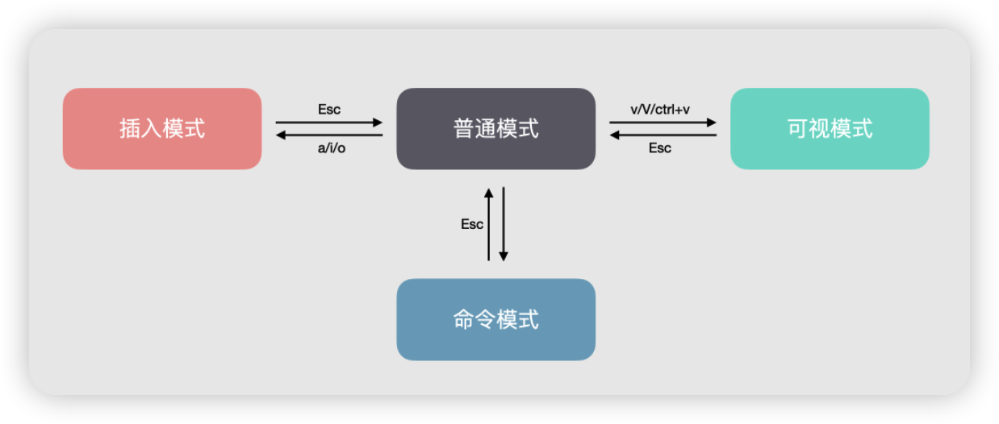
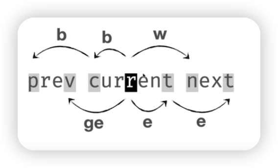
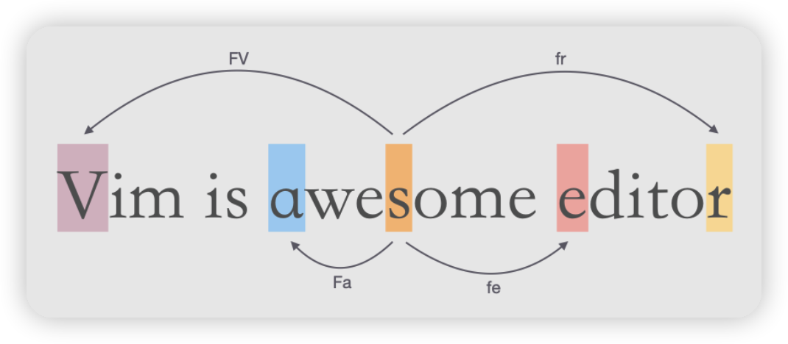
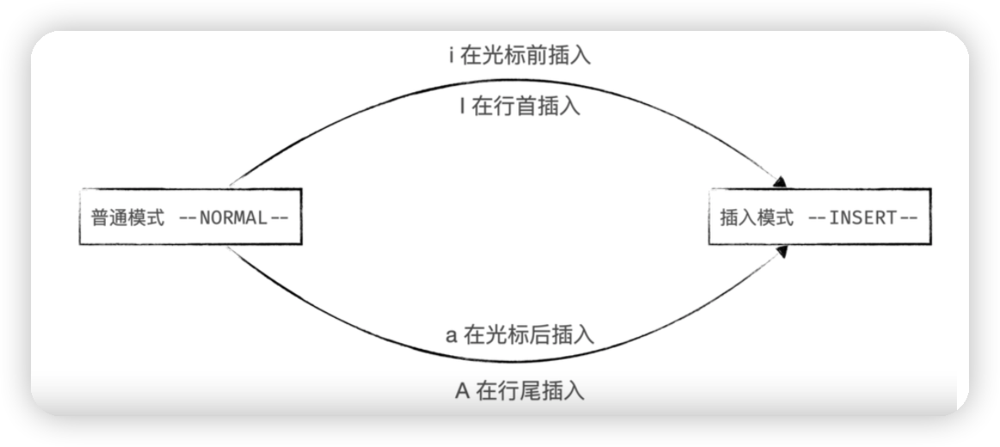
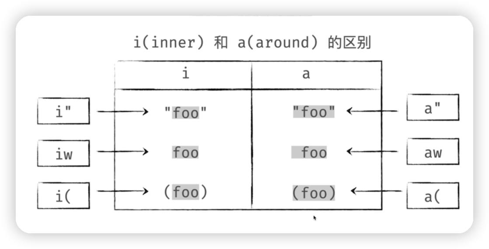

## vim 模式

在 Vim 中有 4 种编辑模式，分别是：普通模式、插入模式、可视模式和命令行模式。使用 Vim 进行编辑就需要熟练的在各个模式之间进行切换。

## 普通模式

### 移动光标

一般情况下每次进入编辑器的时候默认为普通模式，普通模式下常用的用于移动光标的命令：

- `h/j/k/l`：分别代表着向左，下，上，右的方向移动
- `w/b`：跳到下一个单词开头/跳到本单词或上一个单词开头
- `e/ge`：跳到本单词或下一个单词结尾/跳到上一个单词结尾
- `0/$`：跳到行首/跳到行尾
- `^`：跳到行首开始第一个非空字符串
- `gg`：跳到第一行
- `G`：跳到最后一行
- `nG/:n` ：跳到第 n 行
- `f{char}/F{char}`：跳到下一个字符为 char 的位置/跳到上一个字符为 char 的位置
- `t{char}/T{char}`：跳到下一个字符为 char 的前一个字符的位置/跳到上一个字符为 char 的后一个字符的位置
- `;`：重复上次的字符查找操作
- `,`：反向查找上次的查找命令
- `dd`：删除并复制光标当前行
- `yy`：复制光标当前行
- `H`：跳转到屏幕的顶部
- `M`：跳转到屏幕的中间
- `L`：跳转到屏幕的底部
- `(`：跳转到上一个句子
- `)`：跳转到下一个句子
- `{`：跳转到上一个段落
- `}`：跳转到下一个段落
- `u`：撤消
- `Ctrl + r`：恢复撤销
- `p`：粘贴
- `x`：删除当前光标所在的字符
- `r`：替换当前光标所在的字符
- `/{char}`：查找字符

## 插入模式

在插入模式我们能够进行插入字符、换行等操作。从普通模式进入插入模式有许多种方式：

- `i`：在光标的前面进行插入
- `I`：在行首进行插入，相当于`^i`
- `a`：在光标的后面进行插入
- `A`：在行尾进行插入，相当于`$a`
- `o`：在光标所在行后面插入新一行
- `O`：在光标所在行前面插入新一行，相当于`ko`

通过`Esc`或`ctrl + [`可以从插入模式切换到普通模式

## 可视模式

在普通模式里面我们可以使用`v`进入可视模式，在可视模式中允许我们通过普通模式中移动光标的方式来选中某一段内容进行操作。

## 命令模式

在普通模式中我们输入`:`会进入命令模式，在命令模式中我们可以使用与 shell 下的命令行类似的命令

常用命令：

- `:wq`：保存并退出
- `:q!`：强制退出

## 操作符

常用操作：

- `d`：删除并复制
- `c`：修改，删除并进入插入模式
- `y`：复制

## 文本对象

文本对象能够让我们不移动光标的情况下来操作一定区域内的内容。比如：

- `i"`：选中双引号内的内容不包含双引号
- `a"`：选中双引号内的内容包含双引号

## 操作符跟文本对象的结合使用

结合跳转的一些例子：

- `y$`：复制当前位置到行尾的所有内容
- `dw`：删除当前位置到下一个单词的开头
- `c}`：修改当前位置到这个段落的结尾
- `d(`：删除到句子的开头

结合数字的一些例子：

- `y2h`：向左拷贝两个字符
- `d2w`：删除后两个单词
- `c2j`：修改后面两行

结合 i 和 a 的一些例子：

- `di(`：删除括号内的内容
- `di{`：删除大括号内的内容
- `diw`：删除光标所在的单词
- `da(`：删除括号和括号内的内容
- `da{`：删除大括号和大括号内的内容
- `daw`：删除光标所有的单词以及周围的空白
- `df{char}`：删除到下一个 char 字符，包含 char 字符
- `dt{char}`：从当前位置删除到某个字符前为止，不包含 char 字符

## 切换大小写

- `~`：将光标下的字母改变大小写
- `3~`：将光标位置开始的 3 个字母改变大小写
- `g~~`：改变当前行字母的大小写
- `gUU`：将当前行字母改成大写
- `guu`：将当前行字母改成小写
- `gUaw(gUiw)`：将光标下的单词改成大写
- `guaw(guiw)`：将光标下的单词改成小写

## vim-surround

以`hello world`为例

- 给`hello`加单引号，`ysiw'`
- 将 hello 单词的引号改为`()`，`cs'(`
- 将 hello 单词的`()`改为 html 的 h1 标签，`cs(t`后输入 h1 标签按回车
- 将 hello 单词的`h1`标签删除，`dst`
- 给 hello world 加单引号，`yss'`

## 替换

- `:%s/class/className/g`：全局搜索 class 替换为 className
- `:5,12s/class/className/g`：从第 5 行到第 12 行替换 class 为 className

## 用 VSCode 开发中常用的操作

### 函数定义之类：

- `gd`：进入函数定义
- `Ctrl+o`：从函数定义中返回
- `gh`：查看函数参数等信息

### 切换标签页：

- `gt`：切换到下一个标签页
- `gT`：切换到上一个标签页
- `4gt`：切换到第 4 个标签页

其他：可以使用`Ctrl + 0`来将光标从编辑器跳转到文件栏，在文件栏可以使用 j 和 k 进行移动，可以使用 Space 展开或者关闭文件夹，使用 l 可以将光标选中的文件在编辑器中打开。

还有如果使用侧边栏打开文件，可以使用 Ctrl + 1 跟 Ctrl + 2 实现跳转。

### 窗口管理

- `:vs`：左右分屏
- `zc`：折叠代码块
- `zo`：展开代码块
