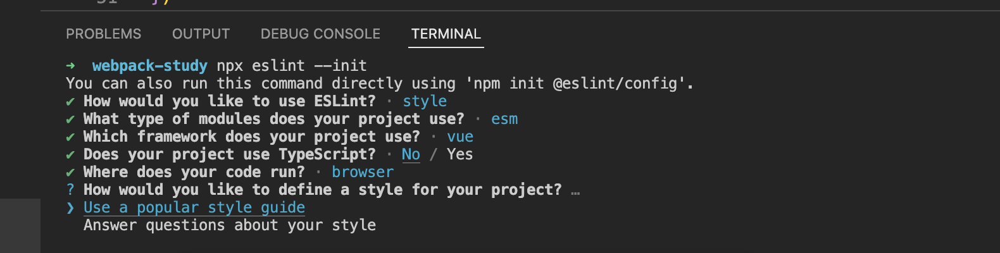
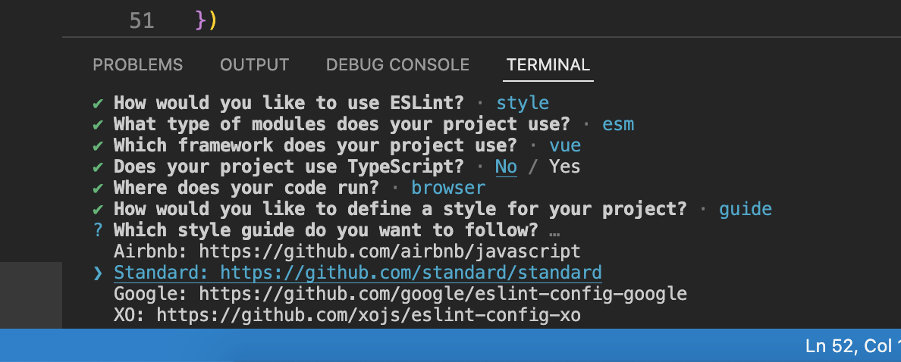

## webpack 四个核心概念

- Entry：入口起点(entry point)指示 webpack 应该使用哪个模块，来作为构建其内部依赖图的开始
- Output：output 属性告诉 webpack 在哪里输出它所创建的 bundles，以及如何命名这些文件，默认值为 ./dist
- Loader：loader 让 webpack 能够去处理那些非 JavaScript 文件，如 css、png、ts 等等（webpack 自身只能解析： JavaScript、json）
- Plugins：插件则可以用于执行范围更广的任务。插件的范围包括，从打包优化和压缩，一直到重新定义环境中的变量等

Webpack 本身只能加载 JS/JSON 模块，如果要加载其他类型的文件(模块)，就需要使用对应的 loader 进行转换/加载

Loader 本身也是运行在 node.js 环境中的 JavaScript 模块，它本身是一个函数，接受源文件作为参数，返回转换的结果。

loader 一般以 xxx-loader 的方式命名，xxx 代表了这个 loader 要做的转换功能，比如 sass-loader

插件件可以完成一些 loader 不能完成的功能，插件的使用一般是在 webpack 的配置信息 plugins 选项中指定

结论：

- webpack 能够编译打包 js 和 json 文件
- 能将 es6 的模块化语法转换成浏览器能识别的语法
- 能压缩代码

缺点：

- 不能编译打包 css、img 等文件
- 不能将 js 的 es6 基本语法转化为 es5 以下语法

改善：使用 webpack 配置文件解决，自定义功能

## 基本配置

### 入口及出口配置

创建`webpack-study`文件夹，在文件夹根目录下依次执行以下命令：

```
npm init -y
npm i webpack webpack-cli -g
npm i webpack webpack-cli -D
```

在`package.json`文件中添加`scripts`命令：

```json
"scripts": {
  "build": "webpack"
}
```

在根目录下新建`webpack.config.js`文件，在这个文件下配置 webpack

```js
const path = require('path')

module.exports = {
  // 模式，默认为production，不填写打包时会有warning
  mode: 'development',

  // 入口文件 index.js
  entry: './src/js/index.js',

  // 输出
  output: {
    // 打包后的输出目录
    path: path.resolve(__dirname, './dist'),
    // 打包后的文件名
    filename: 'js/main.js',
    // 打包后自动清除旧的输出目录
    clean: true
  }
}
```

在根目录下新建`src/js/sum.js`文件

```js
export function useSum(a, b) {
  return a + b
}
```

在根目录下新建`src/js/index.js`文件，这个文件为入口文件

```js
import { useSum } from './sum'

console.log('我是main.js')

console.log(useSum(2, 8))
```

在根目录下新建`public/index.html`，用于引入打包后的 js 文件

```html
<script src="../dist/js/main.js"></script>
```

之后执行`npm run build`来打包，打开 html 文件查看控制台

### 文件的命名规则

有时候我们处理后的文件名称按照一定的规则进行显示，比如保留原来的文件名、扩展名，同时为了防止重复，包含一个 hash 值等。

这个时候我们可以使用 PlaceHolders 来完成，webpack 给我们提供了大量的 PlaceHolders 来显示不同的内容，我们可以在[文档](https://webpack.js.org/loaders/file-loader/#placeholders)中查阅自己需要的 placeholder

常用的 placeholder：

- `[ext]`：处理文件的扩展名
- `[name]`：处理文件的名称
- `[hash]`：文件的内容，使用 MD4 的散列函数处理，生成的一个 128 位的 hash 值(32 个十六进制)
- `[contentHash]`：在 file-loader 中和[hash]结果是一致的(在 webpack 的一些其他地方不一样)
- `[hash:<length>]`：截图 hash 的长度，默认 32 个字符太长了
- `[path]`：文件相对于 webpack 配置文件的路径

### loader 配置方式

module.rules 中允许我们配置多个 loader，这种方式可以更好的表示 loader 的配置，也方便后期的维护，同时也让你对各个 Loader 有一个全局的概览

module.rules 的配置如下：

- rules 属性对应的值是一个数组：[Rule]
- 数组中存放的是一个个的 Rule，Rule 是一个对象，对象中可以设置多个属性：
  - test 属性：用于对 resource(资源)进行匹配的，通常会设置成正则表达式
  - use 属性：对应的值时一个数组[UseEntry]，UseEntry 是一个对象，可以通过对象的属性来设置一些其他属性
    - loader：必须有一个 loader 属性，对应的值是一个字符串
    - options：可选的属性，值是一个字符串或者对象，值会被传入到 loader 中
- loader 属性：`Rule.use: [ { loader } ]`的简写

传递字符串(如：`use: [ 'style-loader' ]`)是 loader 属性的简写方式(如：`use: [ { loader: 'style-loader'} ]`)

### 打包样式

在`public/index.html`中添加

```html
<div id="app"></div>
```

在根目录下新建`src/assets/styles/index.scss`文件夹，用来存放样式文件文件

```scss
#app {
  width: 100px;
  height: 100px;
  display: flex;
  background-color: pink;
}
```

在入口文件`index.js`中引入 scss 文件

```js
import '../assets/styles/index.scss'
```

`.scss`与`.sass`文件用`sass-loader`与`sass`，`.less` 文件用`less-loader`与`less`

```shell
npm i sass sass-loader style-loader css-loader -D
```

在`webpack.config.js`中配置

```js
module: {
  rules: [
    {
      test: /\.(css|s[ac]ss)$/i,
      use: ['style-loader', 'css-loader', 'sass-loader']
    }
  ]
}
```

### 打包 html

html 文件 webpack 不能解析，需要借助插件编译解析

在 public 文件夹下的 html 中不引入任何 css 和 js 文件，修改 title 标签内内容

```html
<title><%= htmlWebpackPlugin.options.title %></title>
```

安装插件`html-webpack-plugin`

```shell
npm i html-webpack-plugin -D
```

```js
const htmlWebpackPlugin = require('html-webpack-plugin')

module.exports = {
  plugins: [
    new htmlWebpackPlugin({
      title: 'webpack5-config',
      // 指定我们要使用的模块所在的路径
      template: path.resolve(__dirname, 'public/index.html')
    })
  ]
}
```

### 打包 css 代码为单独文件

安装插件`mini-css-extract-plugin`，使用该插件后不需要使用`style-loader`

```shell
npm i mini-css-extract-plugin -D
```

```js
const MiniCssExtractPlugin = require('mini-css-extract-plugin')

module.exports = {
  // ...
  module: {
    rules: [
      {
        test: /\.(css|s[ac]ss)$/i,
        use: [MiniCssExtractPlugin.loader, 'css-loader', 'sass-loader']
      }
    ]
  },

  plugins: [
    // ...
    new MiniCssExtractPlugin({
      // 将css代码输出到dist/styles文件夹下
      filename: 'styles/chunk-[contenthash].css',
      ignoreOrder: true
    })
  ]
}
```

### PostCSS

PostCSS 可以帮助我们进行一些 CSS 的转换和适配，比如自动添加浏览器前缀、css 样式的重置

`postcss-preset-env`是一个 postcss 的插件，可以帮助我们将一些现代的 CSS 特性，转成大多数浏览器认识的 CSS，并且会根据目标浏览器或者运行时环境添加所需的 polyfill，也包括会自动帮助我们添加 autoprefixer(所以相当于已经内置了 autoprefixer)

#### 配置方式一

`webpack.config.js`中配置：

```js
module.exports = {
  module: {
    rules: [
      {
        test: /\.(css|s[ac]ss)$/i,
        use: [
          MiniCssExtractPlugin.loader,
          'css-loader',
          // css适配
          {
            loader: 'postcss-loader',
            options: {
              postcssOptions: {
                plugins: [require('postcss-preset-env')]
              }
            }
          },
          'sass-loader'
        ]
      }
    ]
  }
}
```

在`package.json`中添加以下配置：

```json
"browserslist": {
    "development": [
      "last 1 chrome version",
      "last 1 firefox version",
      "last 1 safari version"
    ],
    "production": [">0.01%", "not dead", "not op_mini all"]
}
```

#### 配置方式二

方式二不修改`package.json`文件

根目录下新建`.browserslistrc`文件，配置：

```
# Browsers that we support

last 1 version
> 1%
IE 10 # sorry
```

根目录下新建`postcss.config.js`文件，配置：

```js
module.exports = {
  plugins: ['postcss-preset-env']
}
```

`webpack.config.js`中配置：

```js
module.exports = {
  module: {
    rules: [
      {
        test: /\.(css|s[ac]ss)$/i,
        use: [
          MiniCssExtractPlugin.loader,
          'css-loader',
          // css适配
          'postcss-loader',
          'sass-loader'
        ]
      }
    ]
  }
}
```

### 认识 asset module type

当前使用的 webpack 版本是 webpack5，在 webpack5 之前，加载图片资源等我们需要使用一些 loader，比如 `url-loader`、`file-loader`

在 webpack5 开始，我们可以直接使用资源模块类型(asset module type)，来替代上面的这些 loader

资源模块类型(asset module type)，通过添加 4 种新的模块类型，来替换所有这些 loader：

- `asset/resource`：发送一个单独的文件并导出 URL。之前通过使用`file-loader`实现
- `passet/inline`：导出一个资源的 data URI。之前通过使用`url-loader`实现
- `passet/source`：导出资源的源代码。之前通过使用`raw-loader`实现
- `passet`：在导出一个 data URI 和发送一个单独的文件之间自动选择。之前通过使用`url-loader`，并且配置资源体积限制实现

#### 加载图片设置

测试了下，似乎不添加配置也能打包字体与图片，如果要指定打包后文件夹就得配置

放置一张图片在`src/assets/images`中，修改`index.scss`样式

```scss
#app {
  width: 100px;
  height: 100px;
  display: flex;
  background: url('../images/bg.png') no-repeat;
}
```

在`webpack.config.js`中配置：

```js
module.exports = {
  module: {
    rules: [
      {
        test: /\.(png|jpe?g|gif|svg)$/i,
        type: 'asset/resource',
        // 自定义文件的输出路径和文件名
        generator: {
          filename: 'images/[name]_[hash:5][ext]'
        }
      }
    ]
  }
}
```

#### 加载字体设置

在`public/index.html`中添加字体图标标签类

```html
<div><i class="iconfont icon-beian"></i></div>
```

将字体文件放在`src/assets/fonts`目录下，在`index.scss`文件中引入字体

```scss
@import url('../fonts/iconfont.css');
```

```js
module.exports = {
  module: {
    rules: [
      // ...
      {
        test: /\.(eot|ttf|woff2?)$/,
        type: 'asset/resource',
        generator: {
          filename: 'font/[name]_[hash:5][ext]'
        }
      }
    ]
  }
}
```

### 引入`favicon.ico`图标

在`public`文件夹中放入`favicon.ico`文件，并在 html 文件中引入`favicon.ico`

```html
<link rel="icon" href="<%= BASE_URL %>favicon.ico" />
```

这个时候运行`npm ru build`会报错，因为在我们的模块中还使用到一个 BASE_URL 的常量，这个时候我们可以使用 DefinePlugin 插件

DefinePlugin 允许在编译时创建配置的全局常量，是一个 webpack 内置的插件(不需要单独安装)

```js
const { DefinePlugin } = require('webpack')

module.exports = {
  plugins: [
    new DefinePlugin({
      BASE_URL: '"./"'
    })
  ]
}
```

### CopyWebpackPlugin

在上述操作`npm run build`后发现`public`目录下的`favicon.ico`文件并未打包到 dist 目录下，在 dist 目录下运行时仍没有 ico 图标

`copy-webpack-plugin`插件可以帮助我们将`public`目录的内容复制到`dist`文件夹中

```shell
npm i copy-webpack-plugin -D
```

在`webpack.config.js`中配置

```js
const copyWebpackPlugin = require('copy-webpack-plugin')

module.exports = {
  plugins: [
    new copyWebpackPlugin({
      patterns: [
        {
          // 设置从哪一个源中开始复制
          from: './public',
          globOptions: {
            // 忽略的文件
            ignore: ['**/index.html']
          }
        }
      ]
    })
  ]
}
```

### 配置 babel

`babel`可以将我们项目中的高级语法转化成比较低级的语法，比如可以将 ES6 转为 ES5，这样可以兼容一些低版本浏览器，所以是很有必要的

```shell
npm i babel-loader @babel/core @babel/preset-env -D
```

由于 babel 是针对 js 文件的语法转换，所以我们需要在 webpack.config.js 中去针对 js 进行操作

```js
module.exports = {
  module: {
    rules: [
      // ...
      {
        test: /\.js$/i,
        exclude: /node_modules/,
        use: [
          {
            loader: 'babel-loader',
            // 若配置了babel.config.js，则options不用配置
            options: {
              presets: ['@babel/preset-env']
            }
          }
        ]
      }
    ]
  }
}
```

像之前一样，我们可以将 babel 的配置信息放到一个独立的文件中，babel 给我们提供了两种配置文件的编写

- `babel.config.json`(或者.js，.cjs，.mjs)文件
- `.babelrc.json`(或者.babelrc，.js，.cjs，.mjs)文件

目前很多的项目都采用了多包管理的方式(babel 本身、element-plus、umi 等)

`.babelrc.json`早期使用较多的配置方式，但是对于配置 Monorepos 项目是比较麻烦的

`babel.config.json`(babel7)可以直接作用于 Monorepos 项目的子包，更加推荐

```js
module.exports = {
  presets: [
    // 配置规则
    '@babel/preset-env'
  ]
}
```

### 自动编译打包运行

```shell
npm i webpack-dev-server -D
```

在`webpack.config.js`中配置

```js
module.exports = {
  devServer: {
    port: 8000, // 自定义端口号
    open: true // 自动打开浏览器
  }
}
```

在`package.json`中配置`scripts`命令：

```json
"scripts": {
  "dev":"webpack serve"
}
```

### 打包 vue 文件

先安装以下几个包

```shell
npm i vue vue-loader vue-template-compiler @vue/babel-preset-jsx -D
```

然后我们需要去`webpack.config.js`中配置对`.vue`文件的解析

```js
const { VueLoaderPlugin } = require('vue-loader')

module.exports = {
  module: {
    rules: [
      // ...
      {
        test: /\.vue$/,
        use: 'vue-loader'
      }
    ]
  },
  plugins: [
    // ...
    new VueLoaderPlugin()
  ]
}
```

并且到`babel.config.js`中配置一下，让 webpack 支持`.vue`文件中的 jsx 语法

```js
module.exports = {
  presets: [
    '@babel/preset-env',
    '@vue/babel-preset-jsx' // 支持vue中的jsx语法
  ]
}
```

在 src 下新建一个 App.vue

```vue
<template>
  <div class="box">
    <h1>app...</h1>
    <p>{{ msg }}</p>
  </div>
</template>

<script setup>
import { ref } from 'vue'

const msg = ref('hello vue')
</script>

<style lang="scss" scoped>
.box {
  width: 200px;
  height: 200px;
  background-color: palegreen;
}
</style>
```

然后改写一下`src/js/index.js`

```js
import { createApp } from 'vue'
import App from '../App.vue'

const app = createApp(App)

app.mount('#app')
```

### 配置路径别名

有时候文件引用搁着太多层，引用起来会看起来很不明确，比如`../../../../../App.vue`，所以可以在`webpack.config.js`中配置一下别名 alias

```js
module.exports = {
  resolve: {
    alias: {
      '@': path.resolve(__dirname, './src')
    },
    extensions: ['.js', '.ts', '.scss', '.vue'] // 引入文件时省略后缀名
  }
}
```

### 区分开发和生成环境配置

我们不能把所有配置都配置在一个`webpack.config.js`中，因为我们有两个环境 development(开发环境)、production(生产环境)，所以我们在根目录下创建`config`文件夹，并创建三个文件`webpack.common.js`、`webpack.prod.js`、`webpack.dev.js`

```shell
npm i webpack-merge -D
```

`webpack.common.js`

```js
const path = require('path')
const htmlWebpackPlugin = require('html-webpack-plugin')
const MiniCssExtractPlugin = require('mini-css-extract-plugin')
const { DefinePlugin } = require('webpack')
const { VueLoaderPlugin } = require('vue-loader')

module.exports = {
  // 入口文件 index.js
  entry: './src/js/index.js',

  // 输出
  output: {
    // 打包后的输出目录
    path: path.resolve(__dirname, '../dist'),
    // 打包后的文件名
    filename: 'js/main.js',
    // 打包后自动清除旧的输出目录
    clean: true
  },

  resolve: {
    alias: {
      '@': path.resolve(__dirname, '../src')
    },
    extensions: ['.js', '.ts', '.scss', '.vue'] // 引入文件时省略后缀名
  },

  module: {
    rules: [
      {
        test: /\.(css|s[ac]ss)$/i,
        use: [
          MiniCssExtractPlugin.loader,
          'css-loader',
          // css适配
          'postcss-loader',
          'sass-loader'
        ]
      },

      {
        test: /\.(png|jpe?g|gif|svg)$/i,
        type: 'asset/resource',
        parser: {
          // 转base64的条件
          dataUrlCondition: {
            maxSize: 25 * 1024 // 25kb
          }
        },
        // 自定义文件的输出路径和文件名
        generator: {
          filename: 'images/[name]_[hash:5][ext]'
        }
      },

      {
        test: /\.(eot|ttf|woff2?)$/,
        type: 'asset/resource',
        generator: {
          filename: 'font/[name]_[hash:5][ext]'
        }
      },

      {
        test: /\.js$/i,
        exclude: /node_modules/,
        use: 'babel-loader'
      },

      {
        test: /\.vue$/,
        use: 'vue-loader'
      }
    ]
  },

  plugins: [
    new htmlWebpackPlugin({
      title: 'webpack-study',
      // 指定要使用的模板所在的路径
      template: path.resolve(__dirname + '/../public/index.html')
    }),

    new MiniCssExtractPlugin({
      // 将css代码输出到dist/styles文件夹下
      filename: 'styles/chunk-[contenthash].css',
      ignoreOrder: true
    }),

    new DefinePlugin({
      BASE_URL: '"./"'
    }),

    new VueLoaderPlugin()
  ]
}
```

`webpack.dev.js`

```js
const { merge } = require('webpack-merge')
const commonConfig = require('./webpack.common')

module.exports = merge(commonConfig, {
  // 模式，默认为production，不填写打包时会有warning
  mode: 'development',

  devServer: {
    port: 8000,
    open: true // 自动打开浏览器
  }
})
```

`webpack.prod.js`

```js
const copyWebpackPlugin = require('copy-webpack-plugin')
const { merge } = require('webpack-merge')
const commonConfig = require('./webpack.common.js')

module.exports = merge(commonConfig, {
  // 模式，默认为production，不填写打包时会有warning
  mode: 'production',
  plugins: [
    new copyWebpackPlugin({
      patterns: [
        {
          // 设置从哪一个源中开始复制
          from: './public',
          globOptions: {
            // 忽略的文件
            ignore: ['**/index.html']
          }
        }
      ]
    })
  ]
})
```

**注意路径修改**

然后修改`package.json`中`scripts`命令

```json
"scripts": {
  "dev": "webpack serve --config ./config/webpack.dev.js",
  "build": "webpack --config ./config/webpack.prod.js"
},
```

## 优化

### devtool

此选项控制是否生成，以及如何生成 source map。所有的 source map 模式参考[webpack 官网](https://webpack.docschina.org/configuration/devtool/#root)

- development：使用 eval-cheap-module-source-map 模式，能具体定位到源码位置和源码展示，适合开发模式，体积较小
- production：使用 nosources-source-map，只能定位源码位置，不能源码展示，体积较小，适合生产模式

在`webpack.dev.js`中配置

```js
module.exports = merge(commonConfig, {
  // ...
  devtool: 'eval-cheap-module-source-map'
})
```

在`webpack.prod.js`中配置

```js
module.exports = merge(commonConfig, {
  // ...
  devtool: 'nosources-source-map'
})
```

生产环境代码需要部署到服务器上才能运行，serve 这个库能帮助我们快速搭建一个静态资源服务器

- `npm i serve -g`
- `serve -s dist -p 8000`

### 构建进度条

无论是启动项目时还是打包时，都需要进度条的展示，所以需要把进度条配置在`webpack.common.js`中，我们需要先安装进度条的插件`progress-bar-webpack-plugin`

```shell
npm i progress-bar-webpack-plugin -D
```

```js
const ProgressBarPlugin = require('progress-bar-webpack-plugin')
const chalk = require('chalk')

module.exports = {
  // ...
  plugins: [
    // ...
    new ProgressBarPlugin({
      format: ` build [:bar] ${chalk.green.bold(':percent')} (:elapsed seconds)`
    })
  ]
}
```

### 构建时间优化

多进程打包，可以大大提高构建的速度，使用方法是将 thread-loader 放在比较费时间的 loader 之前，比如 babel-loader

由于启动项目和打包项目都需要加速，所以配置在`webpack.common.js`

```shell
npm i thread-loader -D
```

将之前配置`babel-loader`的位置修改

```js
module.exports = {
  module: {
    rules: [
      {
        test: /\.js$/i,
        exclude: /node_modules/,
        use: ['thread-loader', 'babel-loader']
      }
    ]
  }
}
```

### 开启热更新

比如你修改了项目中某一个文件，会导致整个项目刷新，这非常耗时间。如果只刷新修改的这个模块，其他保持原状，那将大大提高修改代码的重新构建时间

只用于开发中，所以配置在`webpack.dev.js`

```js
module.exports = merge(commonConfig, {
  devServer: {
    // ...
    hot: true
  }
})
```

### CSS 代码压缩

CSS 代码压缩使用`css-minimizer-webpack-plugin`，效果包括压缩、去重

```shell
npm i css-minimizer-webpack-plugin -D
```

代码的压缩比较耗时间，所以只用在打包项目时，所以只需要在`webpack.prod.js`中配置

```js
const CssMinimizerPlugin = require('css-minimizer-webpack-plugin')

module.exports = merge(commonConfig, {
  // ...
  optimization: {
    minimizer: [new CssMinimizerPlugin()]
  },
  plugins: [
    //  ...
    new CssMinimizerPlugin() // 去重压缩css
  ]
})
```

### JS 代码压缩

JS 代码压缩使用`terser-webpack-plugin`，实现打包后 JS 代码的压缩

```shell
npm i terser-webpack-plugin -D
```

```js
const TerserPlugin = require('terser-webpack-plugin')

module.exports = merge(commonConfig, {
  optimization: {
    minimizer: [
      // ...

      new TerserPlugin({
        // 压缩JS代码
        terserOptions: {
          compress: {
            drop_console: true // 去除console
          }
        }
      })
    ]
  }
})
```

### 打包体积分析

使用`webpack-bundle-analyzer`可以审查打包后的体积分布，进而进行相应的体积优化

```js
npm i webpack-bundle-analyzer -D
```

只需要打包时看体积，所以只需在`webpack.prod.js`中配置

```js
const { BundleAnalyzerPlugin } = require('webpack-bundle-analyzer')

module.exports = merge(commonConfig, {
  plugins: [
    //  ...

    new BundleAnalyzerPlugin()
  ]
})
```

### Gzip

开启 Gzip 后，大大提高用户的页面加载速度，因为 gzip 的体积比原文件小很多，当然需要后端的配合，使用 `compression-webpack-plugin`

```shell
npm i compression-webpack-plugin -D
```

```js
const CompressionPlugin = require('compression-webpack-plugin')

module.exports = merge(commonConfig, {
  plugins: [
    // ...

    new CompressionPlugin({
      algorithm: 'gzip',
      threshold: 10240,
      minRatio: 0.8
    })
  ]
})
```

## 规范

### Eslint

```shell
npm i eslint -D
```

首先通过命令创建`.eslintrc.js`文件。 执行

```shell
npx eslint --init
```




配置`.eslintignore`，eslint 有时会校验一些我们不想让它校验的文件，我们可以加一下这个配置

```
config/
node_modules/
.husky
.local
dist
/public
```

我们现在只是完成了 Eslint 的自身配置，但是我们的目的是要开发构建时能在终端提示语法错误，所以需要将 Eslint 配置在`webpack.dev.js`中

```shell
npm i eslint-webpack-plugin -D
```

```js
const ESLintPlugin = require('eslint-webpack-plugin')

module.exports = merge(commonConfig, {
  plugins: [
    new ESLintPlugin({
      // 运行的时候自动帮你修复错误
      fix: true
    })
  ]
})
```

### Prettier

```shell
npm i prettier -D
```

根目录下配置`.prettierrc`文件

```
{
  "useTabs": false,
  "tabWidth": 2,
  "printWidth": 80,
  "singleQuote": true,
  "trailingComma": "none",
  "semi": false,
  "arrowParens": "avoid",
  "space-before-function-paren": true
}
```

项目下新建`.prettierignore`

```
# 忽略格式化文件 (根据项目需要自行添加)
node_modules
dist
```

### 解决 Prettier 和 ESLint 的冲突

```shell
npm i eslint-plugin-prettier eslint-config-prettier -D
```

在`.eslintrc.js`添加 prettier 插件

```js
module.exports = {
  ...
extends: [
    'plugin:vue/essential',
    'standard','plugin:prettier/recommended'
  ],
  ...
}
```

### husky 和 lint-staged 构建代码工作流

虽然我们已经要求项目使用 eslint 了，但是不能保证其它成员提交代码之前都将 eslint 中的问题解决掉了，也就是我们希望保证代码仓库中的代码都是符合 eslint 规范的。

可以通过 Husky 工具在其它成员执行`git commit`命令的时候对其进行校验，如果不符合 eslint 规范，那么自动通过规范进行修复

husky 是一个 git hook 工具，可以帮助我们触发 git 提交的各个阶段：pre-commit、commit-msg、pre-push

使用自动配置命令：

```shell
npx husky-init && npm install
```

#### git commit 规范

Commitizen 是一个帮助我们编写规范 commit message 的工具，使用 Commitizen 工具按照统一的风格来 git commit，这样可以快速定位每次提交的内容，方便之后对版本进行控制

安装 Commitizen

```shell
npm install commitizen -D
```

安装 cz-conventional-changelog，并且初始化 cz-conventional-changelog：

```shell
npx commitizen init cz-conventional-changelog --save-dev --save-exact
```

在`package.json`中配置一个 scripts：

```json
{
  "commit": "cz"
}
```

每次`npm run commit`进行代码提交

#### 代码提交验证

如果我们按照 cz 来规范了提交风格，但是依然有其它成员通过 `git commit` 按照不规范的格式提交应该怎么办呢？

通过 commitlint 来限制提交

安装 @commitlint/config-conventional 和 @commitlint/cli

```shell
npm i @commitlint/config-conventional @commitlint/cli -D
```

在根目录创建`commitlint.config.js`文件，配置 commitlint

```js
module.exports = {
  extends: ['@commitlint/config-conventional']
}
```

使用 husky 生成 commit-msg 文件，验证提交信息

```shell
npx husky add .husky/commit-msg "npx --no-install commitlint --edit $1"
```

#### 安装 lint-staged

```shell
npm i lint-staged -D
```

修改`./husky/pre-commit`钩子

```shell
npx lint-staged

```

在`package.json`中配置

```json
"lint-staged": {
  "src/**/*.{js,jsx,ts,.tsx,vue,html,md}": "eslint --config .eslintrc.js",
}

```
