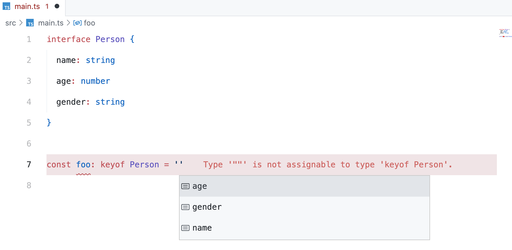
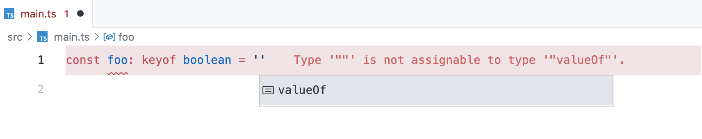
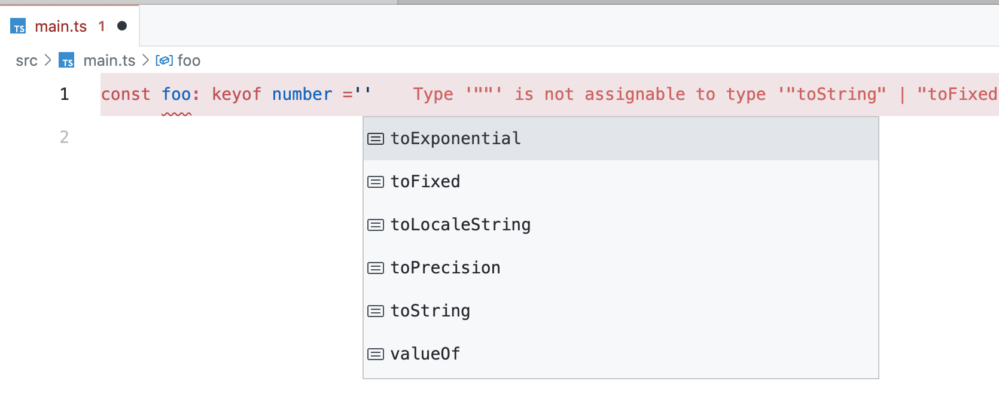
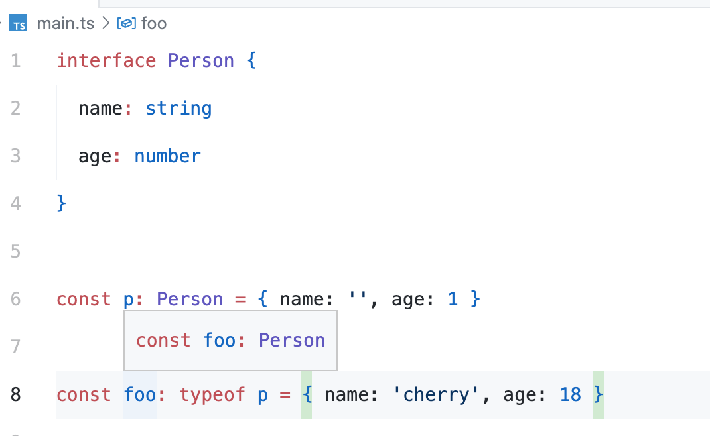
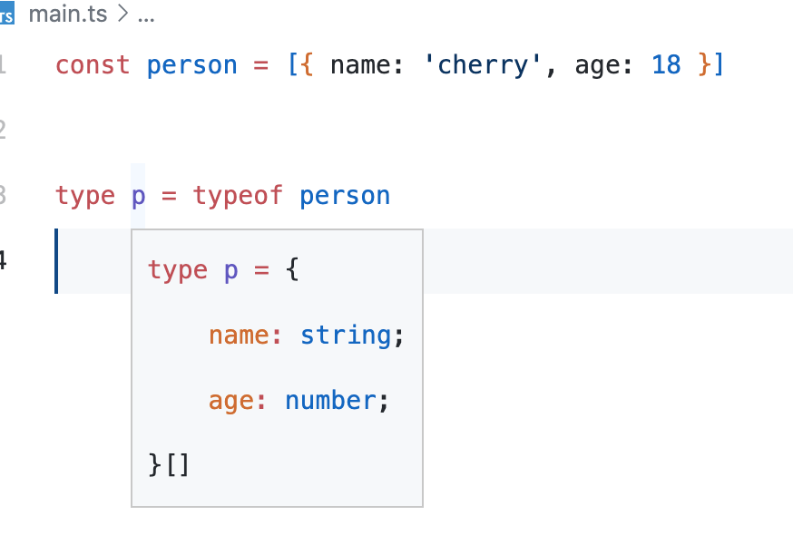
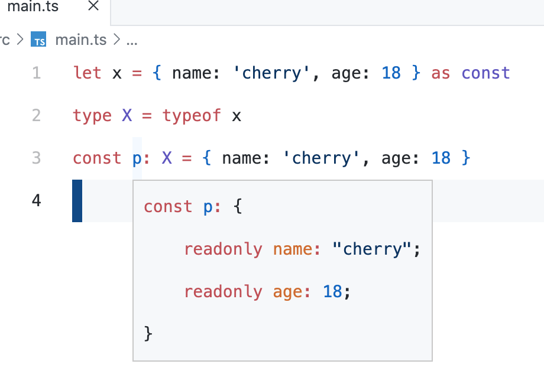

## keyof

keyof 操作符可以用于获取某种类型的所有键，其返回类型是联合类型。

```ts
interface Person {
  name: string
  age: number
  gender: string
}

type K1 = keyof Person
```



keyof 操作符除了支持接口和类之外，它也支持基本数据类型：





此外 keyof 也称为输入索引类型查询，与之相对应的是索引访问类型，也称为查找类型。在语法上，它们看起来像属性或元素访问，但最终会被转换为类型：

```ts
interface Person {
  name: string
  age: number
  gender: string
}

type P1 = Person['age'] // P1类型为number
type P2 = Person['name' | 'age'] // string | number
type P3 = string['charAt'] // (pos: number) => string
type P4 = string[]['push'] // (...items: string[]) => number
type P5 = string[][0] // string
```

在使用对象的数值属性时，我们也可以使用 keyof 关键字。如果我们定义一个带有数值属性的对象，那么我们既需要定义该属性，又需要使用数组语法访问该属性

## typeof

typeof 操作符可以用来获取一个变量或对象的类型

```ts
interface Person {
  name: string
  age: number
}

const p: Person = { name: '', age: 1 }

const foo: typeof p = { name: 'cherry', age: 18 }
```



```ts
const person = [{ name: 'cherry', age: 18 }]

type p = typeof person
```



typeof 操作符用于获取变量的类型，因此这个操作符的后面接的始终是一个变量，且需要运用到类型定义当中

## const 断言

当我们使用 const 断言构造新的字面量表达式时，我们可以向语言发出以下信号：

- 该表达式中的字面类型不应被扩展
- 对象字面量获取只读属性
- 数组文字成为只读元组

```ts
const locales = [
  {
    locale: 'zh-CN',
    language: '中文'
  },
  {
    locale: 'en',
    language: 'English'
  }
] as const

type K = typeof locales[number]['locale'] // type K = "zh-CN" | "en"
```


