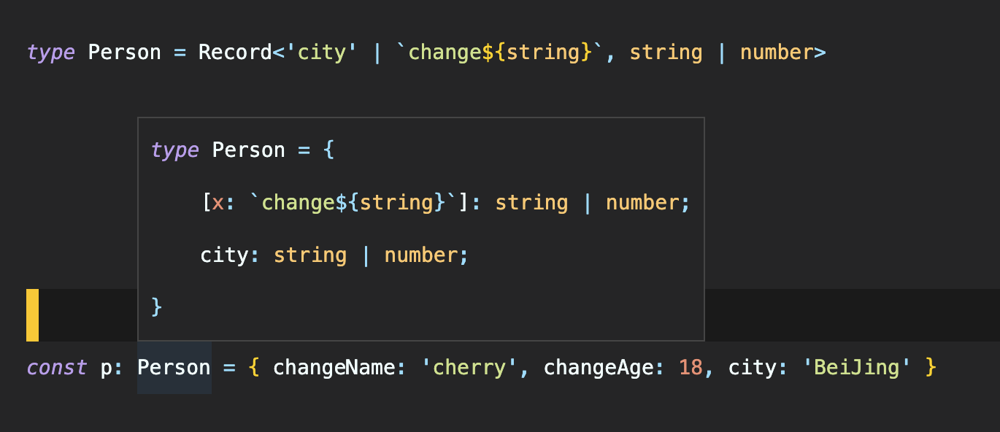
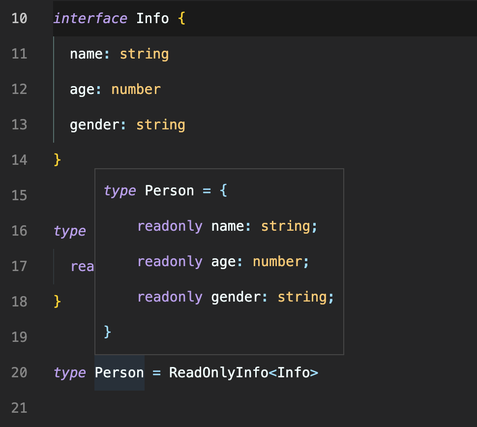
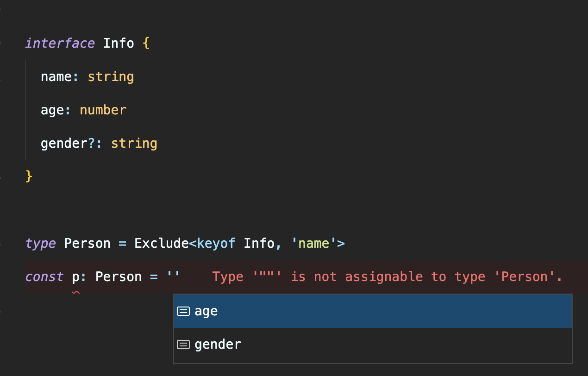
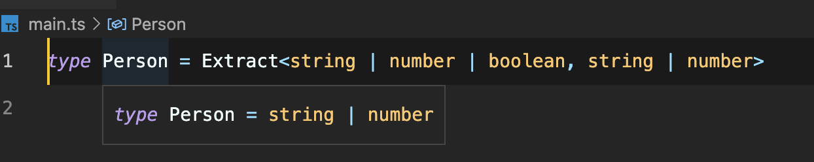

## 索引签名

如果定义任意属性的签名，可以使用索引签名完成

```ts
type Person = {
  [key: `change${string}`]: keyof any
  city: string
}
```


也可以使用 Record 工具类型来定义

```ts
type Person = Record<'city' | `change${string}`, string | number>
```



## 映射类型

映射类型是一种泛型类型，可用于把原有的对象类型映射成新的对象类型。

映射类型的语法如下：

```ts
{ [ P in K ] : T }
```

其中`P in K`类似于 JavaScript 中的`for...in`语句，用于遍历 K 类型中的所有类型，而 T 类型变量用于表示 TS 中的任意类型。

```ts
interface Info {
  name: string
  age: number
  gender: string
}

type ReadOnlyInfo<T> = {
  readonly [P in keyof T]: T[P]
}

type Person = ReadOnlyInfo<Info>
```

- `keyof T`：通过 keyof 操作符获取泛型 T 中所有 key，返回一个联合类型
- `in`：类似 JS 中`for...in`中的 in，用来遍历目标类型的公开属性名
- `T[P]`：是个索引访问类型（也称查找类型），获取泛型 T 中 P 类型，类似 JS 中的访问对象的方式



工具类型 Partial、Readonlay、Required 等类型原理就是通过映射类型实现的

## Required

用来将类型的所有属性设置为必选属性

```ts
type Required<T> = {
  [P in keyof T]-?: T[P]
}
```

`-?`符号可以暂时理解为**将可选属性转换为必选属性**

## Exclude

用来从指定的联合类型中排除指定类型

```ts
type Exclude<T, U> = T extends U ? never : T
```

```ts
interface Info {
  name: string
  age: number
  gender?: string
}

type Person = Exclude<keyof Info, 'name'>
const p: Person = 'gender'
```



## Extract

用来从指定的类型中提取指定类型



## Pick

用来从指定类型中选择指定属性并返回

```ts
type Pick<T, K extends keyof T> = {
  [P in K]: T[P]
}
```

```ts
interface Info {
  name: string
  age: number
  gender?: string
}

type Person = Pick<Info, 'name' | 'age'> // 相当于type Person = {name:string; age:number}
```

## Omit

使用 Omit 工具类型，我们可以很方便地过滤掉对象类型中不需要的属性

```ts
type Omit<T, K extends string | number | symbol> = {
  [P in Exclude<keyof T, K>]: T[P]
}
```

```ts
type User = {
  id: number
  name: string
  password: string
  createdAt: Date
  updatedAt: Date
}

type RegisterUser = Omit<User, 'id' | 'createdAt' | 'updatedAt'> // 相当于type RegisterUser = {name: string; password: string;}
```
